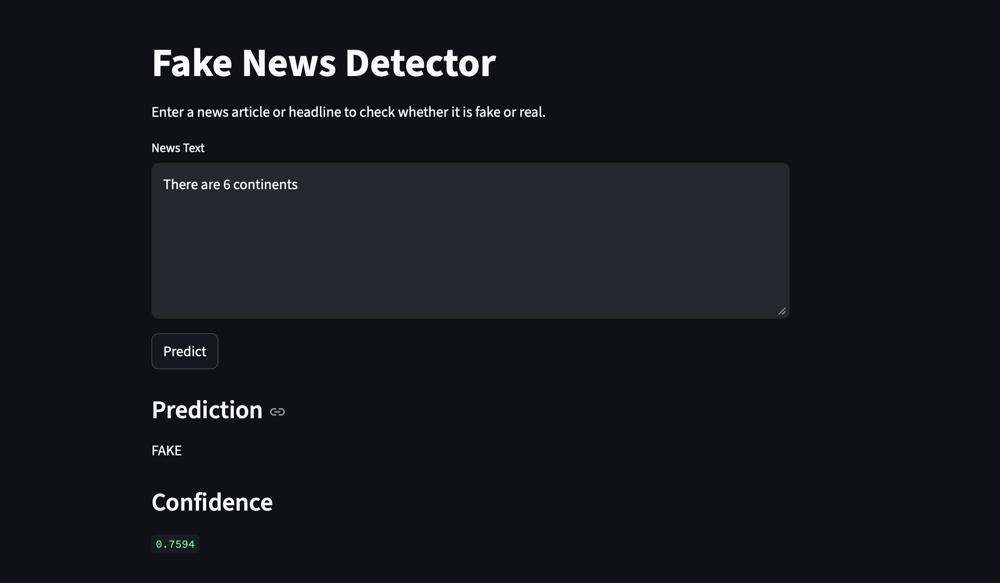

# Fake News Detector

A full-stack machine learning application that detects whether a news article is **FAKE** or **REAL** using Natural Language Processing (NLP) techniques.

The project uses **TF-IDF vectorization** and **Logistic Regression** for text classification, with a **FastAPI backend** and **Streamlit frontend** for real-time predictions.

---

# Features

- Fake vs Real news classification
- NLP text preprocessing
- TF-IDF vectorization
- Logistic Regression model
- FastAPI backend API
- Streamlit frontend UI
- Real-time predictions
- Confidence score generation
- Trained on large-scale news dataset

---

# Tech Stack

## Backend
- Python
- FastAPI
- Uvicorn

## Machine Learning / NLP
- scikit-learn
- TF-IDF Vectorization
- Logistic Regression
- pandas
- joblib

## Frontend
- Streamlit

---

# Model Performance

The model was trained on a large-scale fake news dataset containing thousands of real and fake news articles.

## Accuracy

```text
98.89%
Classification Report
              precision    recall  f1-score   support

        FAKE       0.99      0.99      0.99
        REAL       0.98      0.99      0.99
Project Structure
Fake_news/
│
├── app.py
├── frontend.py
├── predict.py
├── train_model.py
├── requirements.txt
├── README.md
├── .gitignore
│
├── models/
│   ├── fake_news_model.pkl
│   └── vectorizer.pkl
│
└── screenshots/
# Screenshots



## API Testing

!(screenshots/img2.png)

Dataset

This project uses a large-scale fake news dataset containing:

Fake news articles
Real news articles

Dataset files:

Fake.csv
True.csv
Installation
Clone repository
git clone https://github.com/YOUR_USERNAME/YOUR_REPOSITORY.git
cd Fake_news
Create virtual environment
python3 -m venv venv
source venv/bin/activate
Install dependencies
pip install -r requirements.txt
Train the Model
python3 train_model.py

This generates:

models/fake_news_model.pkl
models/vectorizer.pkl
Run Backend
uvicorn app:app --reload

Backend runs on:

http://127.0.0.1:8000

API Docs:

http://127.0.0.1:8000/docs
Run Frontend

Open a new terminal:

cd Fake_news
source venv/bin/activate
streamlit run frontend.py

Frontend runs on:

http://localhost:8501
API Endpoint
POST /predict
Request
{
  "text": "Aliens secretly control world governments"
}
Response
{
  "prediction": "FAKE",
  "confidence": 0.98
}
How It Works
User Input
    ↓
Frontend (Streamlit)
    ↓
FastAPI Backend
    ↓
TF-IDF Vectorization
    ↓
Logistic Regression Prediction
    ↓
Prediction Returned
Future Improvements
BERT / Transformer-based classification
Explainable AI (SHAP/LIME)
News source credibility scoring
Database integration
Docker deployment
AWS deployment
User authentication
Real-time fact-checking APIs
